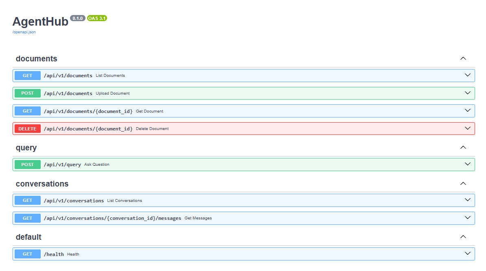
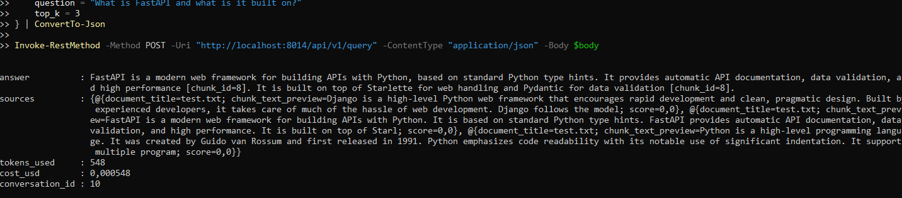
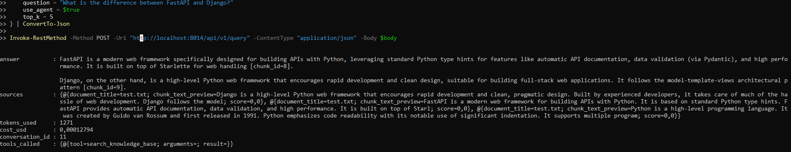
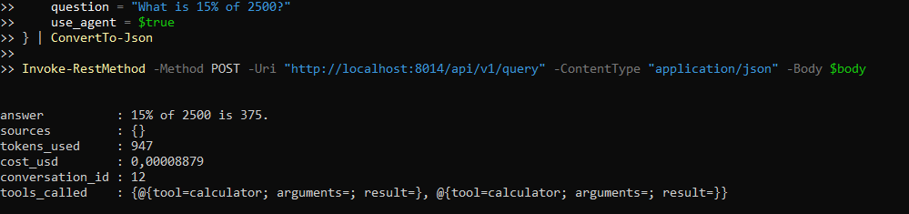
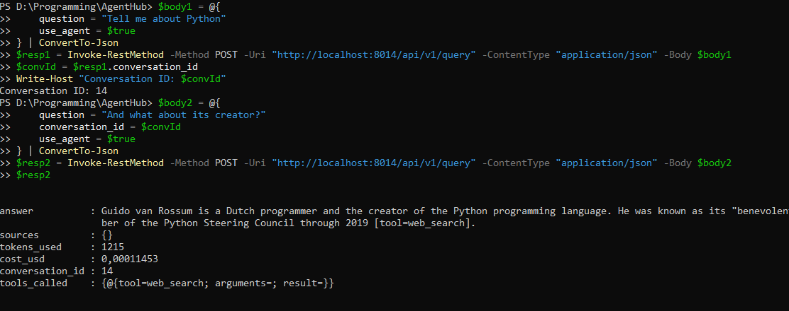
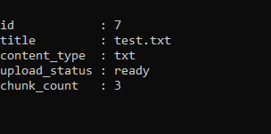
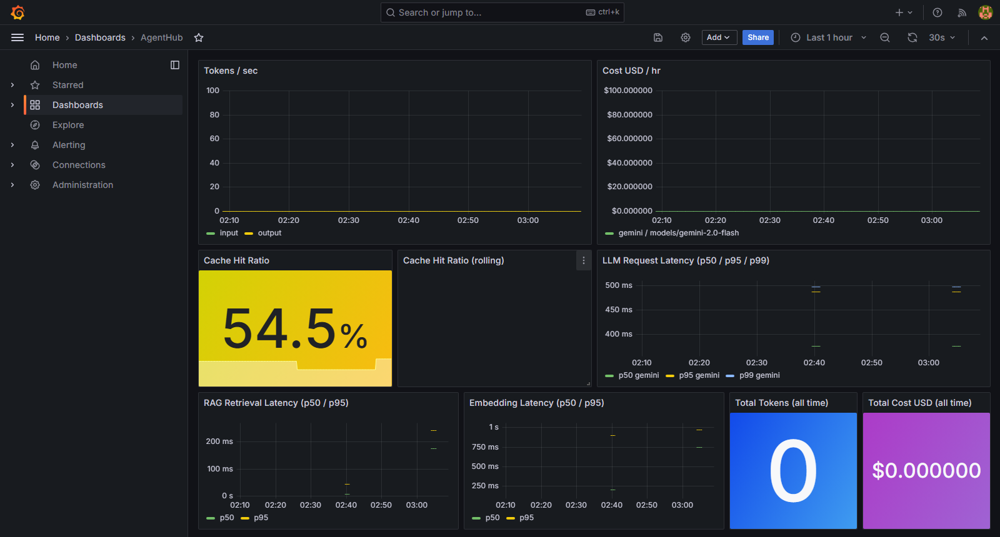
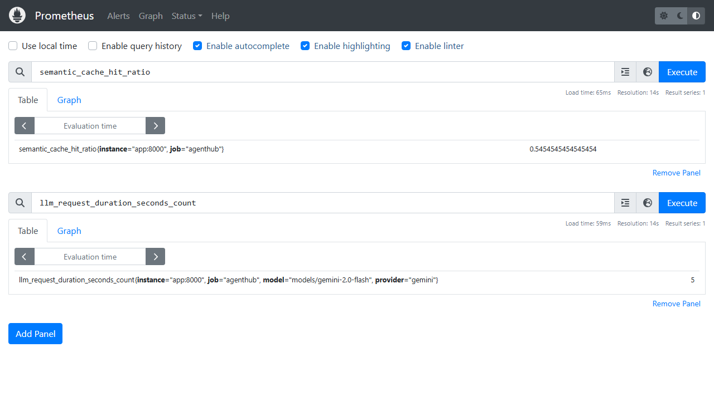

# AgentHub

[](https://github.com/sayomiyori/AgentHub/actions)
[](#)
[](#)
[](#)
[](#)
[](#)
[](#)
[](#)
[](#)
[](LICENSE)

AI platform with **RAG pipeline** (pgvector + semantic search + reranking), **AI agents** with function calling, **MCP server** (SSE), **multi-provider LLM routing** (Gemini / Anthropic / OpenAI), **semantic cache**, **cost tracking**, and **Prometheus** metrics.

## Architecture

```
┌──────────┐     ┌──────────────────┐     ┌───────────────────┐
│ Client   │────▶│ FastAPI Gateway  │────▶│ Agent Orchestrator│
│ REST API │     │ /api/v1/*        │     │ tool use + RAG    │
└──────────┘     │ /mcp/sse         │     └────┬────────┬─────┘
                 │ /metrics         │          │        │
                 └──────────────────┘          ▼        ▼
                              ┌─────────────────┐  ┌──────────────────┐
                              │ RAG Pipeline    │  │ Tool Executor    │
                              │ pgvector search │  │ MCP client       │
                              │ chunk + embed   │  │ KB / calc / web  │
                              │ rerank          │  │ datetime         │
                              └────────┬────────┘  └──────────────────┘
                                       │
                              ┌────────┴────────┐
                              │ PostgreSQL      │
                              │ + pgvector      │
                              │ + llm_usage     │
                              └─────────────────┘

  ┌─────────┐  ┌──────────┐  ┌────────────┐
  │ Redis   │  │ Celery   │  │ Prometheus │
  │ semantic│  │ embed    │  │ + Grafana  │
  │ cache   │  │ worker   │  │            │
  └─────────┘  └──────────┘  └────────────┘
```

## Screenshots

### Swagger UI


### RAG Query — answer with citations


### Agent — knowledge base search tool


### Agent — calculator tool


### Conversation History


### Documents List


### Grafana Dashboard


### Prometheus Metrics


## Tech Stack

| Component | Technology |
|-----------|-----------|
| API | FastAPI (asyncio) |
| Database | PostgreSQL 16 + pgvector extension |
| ORM | SQLAlchemy 2 (async) + Alembic |
| Embeddings | Gemini `gemini-embedding-001` (3072d) |
| LLM | Gemini (default), Anthropic, OpenAI — multi-provider |
| Agent | JSON tool protocol: KB search, web search, calculator, datetime, MCP tools |
| MCP | SSE server + external MCP client |
| Async tasks | Celery + Redis broker (document embedding) |
| Cache | Redis semantic cache (LSH + cosine ≥ 0.95, TTL 24h) |
| Cost tracking | `llm_usage_records` table + `/api/v1/usage/stats` |
| Metrics | Prometheus + Grafana |
| CI | GitHub Actions (ruff + mypy + pytest + Docker build) |

## Architecture Decisions

**pgvector over dedicated vector DB (Pinecone, Weaviate)** — keeps the entire data layer in a single PostgreSQL instance. No extra infrastructure, simpler backups, transactional consistency between document metadata and embeddings. IVFFlat index handles the expected scale.

**Gemini as default provider** — free tier for embeddings + LLM, sufficient for development and demo. Multi-provider factory (`LLMFactory`) allows switching to Anthropic or OpenAI per-request without code changes.

**Semantic cache in Redis (LSH buckets)** — near-identical questions return cached answers without burning tokens. Cosine similarity ≥ 0.95 threshold balances hit rate vs answer relevance. TTL 24h prevents stale answers.

**Celery for embedding, not in-request** — embedding a large document blocks the API for seconds. Celery worker processes documents asynchronously; the client polls `GET /documents/{id}` for status.

**MCP over custom tool protocol** — Model Context Protocol is an emerging standard. Implementing it means external agents (Claude Desktop, Cursor) can use AgentHub's knowledge base as a tool — not just our own agent.

## Quick Start

```bash
cp .env.example .env
# Set GEMINI_API_KEY in .env

docker compose up --build -d
```

| Service | URL |
|---------|-----|
| API | `http://localhost:8014` |
| Health | `http://localhost:8014/health` |
| Swagger | `http://localhost:8014/docs` |
| Prometheus | `http://localhost:59090` |
| Grafana | `http://localhost:3005` (admin / admin) |

## API

### Documents

#### `POST /api/v1/documents`

Upload a document (txt, md, pdf). Triggers async Celery embedding.

```bash
curl.exe -s -X POST "http://localhost:8014/api/v1/documents" -F "file=@document.txt"
```

Response: `{"document_id": "...", "status": "processing"}`

#### `GET /api/v1/documents`

List all documents with statuses (`pending` / `processing` / `ready` / `failed`).

#### `GET /api/v1/documents/{id}`

Document metadata + chunk count.

#### `DELETE /api/v1/documents/{id}`

Delete document + cascade chunks.

---

### Query

#### `POST /api/v1/query`

Ask a question. Supports RAG and agent mode.

```json
{
  "question": "What is FastAPI built on?",
  "use_agent": false,
  "top_k": 5,
  "provider": "gemini",
  "model": "models/gemini-2.0-flash"
}
```

Response:
```json
{
  "answer": "FastAPI is built on Starlette for web handling and Pydantic for data validation...",
  "sources": [
    {"document_title": "docs.txt", "chunk_text_preview": "FastAPI is built on...", "score": 0.92}
  ],
  "tokens_used": 450,
  "cost_usd": 0.0003,
  "conversation_id": "uuid..."
}
```

| Parameter | Description |
|-----------|-------------|
| `question` | Required. The question to ask |
| `use_agent` | `false` = direct RAG, `true` = agent with tools |
| `conversation_id` | Continue existing conversation |
| `top_k` | Number of chunks to retrieve (default: 5) |
| `provider` | `gemini` / `anthropic` / `openai` |
| `model` | Model name (e.g. `models/gemini-2.0-flash`) |

---

### Conversations

#### `GET /api/v1/conversations`

List all conversations.

#### `GET /api/v1/conversations/{id}/messages`

Message history for a conversation.

---

### Cost Tracking

#### `GET /api/v1/usage/stats`

Aggregated LLM cost and token usage.

```json
{
  "total_cost_usd": 0.0123,
  "total_tokens": 45000,
  "cost_by_provider": {"gemini": 0.01},
  "cost_by_model": {"models/gemini-2.5-flash": 0.01},
  "cost_by_day": [{"day": "2026-03-27", "cost_usd": 0.0123}]
}
```

---

### Metrics

#### `GET /metrics`

Prometheus text exposition.

| Metric | Type | Description |
|--------|------|-------------|
| `llm_requests_total` | Counter | LLM calls; labels: `provider`, `model`, `status` |
| `llm_tokens_used_total` | Counter | Tokens; labels: `provider`, `model`, `direction` |
| `llm_cost_usd_total` | Counter | Cost in USD; labels: `provider`, `model` |
| `llm_request_duration_seconds` | Histogram | LLM request latency |
| `rag_retrieval_duration_seconds` | Histogram | Vector search latency |
| `embedding_duration_seconds` | Histogram | Embedding generation latency |
| `documents_total` | Gauge | Total documents |
| `chunks_total` | Gauge | Total chunks |
| `semantic_cache_hit_ratio` | Gauge | Cache hit ratio |
| `mcp_tool_calls_total` | Counter | MCP tool invocations |

## MCP

### Local MCP Server

SSE endpoint: `GET http://localhost:8014/mcp/sse`

Tools: `search_documents`, `list_documents`. Resource template: `document://{document_id}`.

### External MCP Servers

```env
MCP_SERVERS=[{"name":"local-docs","url":"http://127.0.0.1:8014/mcp/sse"}]
```

On startup, AgentHub connects via SSE and merges external tools into the agent (prefixed names like `agenthub__search_documents`).

## Running Tests

```bash
pip install -r requirements.txt

# Lint + type check
ruff check .
python -m mypy app/models/llm_usage.py app/services/usage_tracker.py app/metrics.py

# Tests
pytest tests/
```

CI: GitHub Actions — ruff, mypy (subset), pytest, Docker build, PostgreSQL + Redis services.

## Environment Variables

| Variable | Purpose |
|----------|---------|
| `GEMINI_API_KEY` | Gemini LLM + embeddings |
| `DATABASE_URL` | PostgreSQL connection |
| `REDIS_URL` | Celery broker + semantic cache |
| `LLM_PROVIDER` | Default provider (`gemini`) |
| `LLM_MODEL` | Default model |
| `EMBEDDING_MODEL` | Embedding model |
| `SEMANTIC_CACHE_ENABLED` | `true` / `false` |
| `MCP_SERVERS` | JSON list of `{name, url}` |
| `LLM_FALLBACK_PROVIDER` | Fallback if primary fails |
| `ANTHROPIC_API_KEY` | Optional: Anthropic provider |
| `OPENAI_API_KEY` | Optional: OpenAI provider |

## Project Structure

```
agenthub/
├── app/
│   ├── api/v1/          # REST endpoints
│   ├── models/          # SQLAlchemy models (document, chunk, conversation, usage)
│   ├── services/
│   │   ├── rag/         # chunker, embedder, retriever, reranker, generator
│   │   ├── agent/       # orchestrator, tools (KB, calc, web, datetime, MCP)
│   │   └── llm/         # multi-provider factory (Gemini, Anthropic, OpenAI)
│   ├── mcp/             # MCP server + client
│   ├── cache/           # semantic cache (Redis + LSH)
│   └── metrics.py       # Prometheus metrics
├── monitoring/          # Prometheus + Grafana configs
├── tests/
├── docs/images/         # Screenshots
├── docker-compose.yml
├── Dockerfile
└── alembic.ini
```

## License

MIT License. See [LICENSE](LICENSE) for details.
